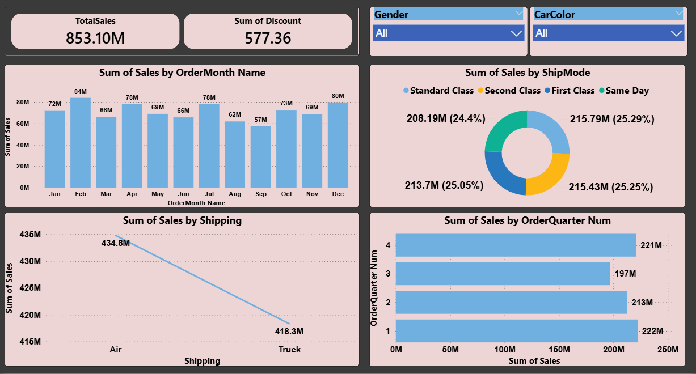
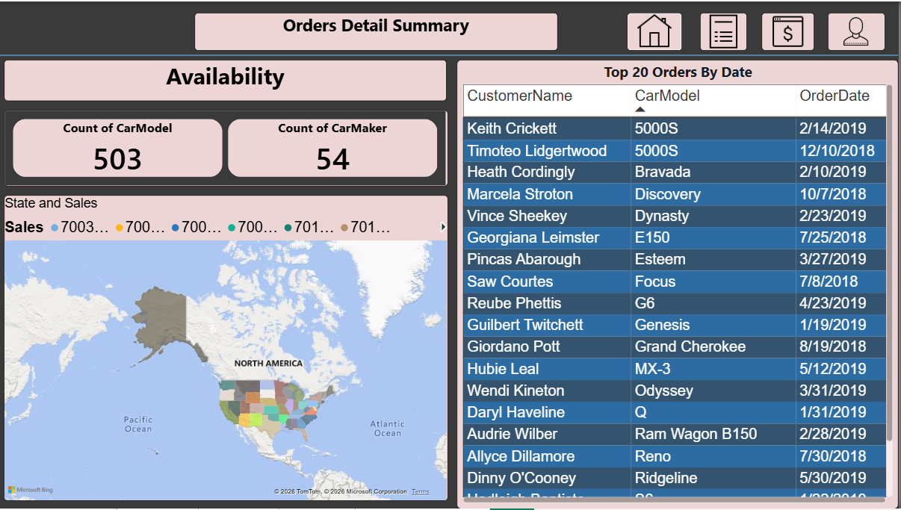
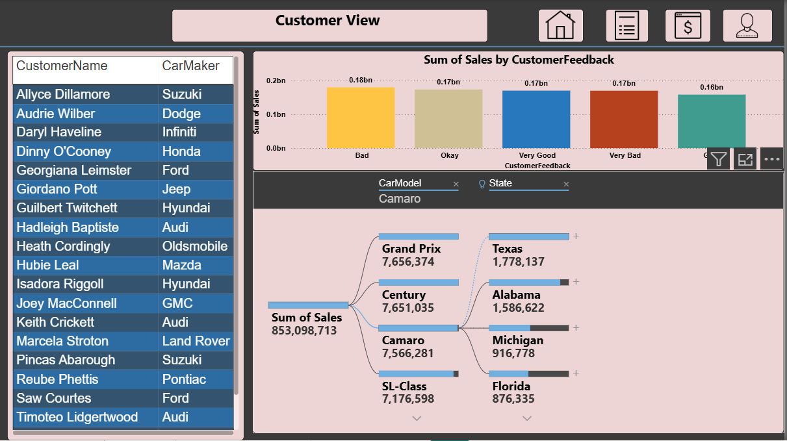

CAR SUPPLY CHAIN ANALYTICS

Business-Focused Data Analytics Project
Python | Power BI | SQL-ready

PROJECT OVERVIEW
This project delivers an end-to-end analysis of an automotive supply chain dataset
with the objective of transforming raw transactional data into decision-ready
business insights.

The analysis focuses on sales performance, logistics efficiency, customer behavior,
and product availability. Python is used for data validation and analysis, while
Power BI is used to build interactive dashboards for business stakeholders.

Core Business Question:
Which regions, products, shipping modes, and customers are driving revenue, and
where are operational or strategic risks emerging?

PROJECT STRUCTURE

car-supply-chain-analytics
|
|-- data
|   |-- raw
|       |-- supply_chain_final.csv
|
|-- notebooks
|   |-- car_supply_chain_python_analysis.ipynb
|
|-- screenshots
|   |-- sales_analysis_dashboard.png
|   |-- orders_availability_dashboard.png
|   |-- customer_view_dashboard.png
|
|-- README.md

TOOLS AND TECHNOLOGIES
Python (Pandas) for data loading, validation, and exploratory analysis
Jupyter Notebook as the analysis environment
Power BI for interactive dashboards and business storytelling
Git and GitHub for version control and portfolio presentation

DATASET SUMMARY
Total Records: 1,000 transactions
Total Columns: 33
Geography: Multiple U.S. states
Car Makers: 54
Car Models: 503
Total Sales Analyzed: 853 Million USD

Key Fields:
CarMaker, CarModel, State, OrderDate, ShipMode, Sales, Quantity, Discount,
CustomerName, CustomerFeedback

ANALYTICAL WORKFLOW

Data Validation and Exploration
The CSV data was loaded using Pandas. Schema, data types, and record counts were
verified. Exploratory analysis was performed to understand sales trends, order
patterns, and customer behavior.

Data Preparation
Metrics were aggregated by region, product, shipping mode, and customer to support
dashboard development and stakeholder analysis.

Visualization and Storytelling
Three business-focused Power BI dashboards were created to address different
decision-making perspectives.

DASHBOARD INSIGHTS

Sales Performance Dashboard

Key Insights:
Total sales exceed 853 million USD
Clear monthly and quarterly seasonality patterns
Sales contribution comparison by shipping mode
Impact of discounts on revenue

Orders and Availability Dashboard

Key Insights:
State-wise distribution of orders
Recent orders monitoring for operations
Product availability overview
High-performing regions identified

Customer Analytics Dashboard

Key Insights:
Identification of high-value customers
Sales contribution by customer feedback
Drill-down analysis by state and car model
Revenue concentration among a limited customer segment

BUSINESS IMPACT
Improves visibility into regional and product-level sales performance
Supports data-driven shipping and logistics decisions
Enables prioritization of high-value customers
Reduces reliance on manual reporting through automated dashboards
Aligns sales, operations, and leadership teams around a single data view

RECOMMENDATIONS
Focus on high-performing regions for targeted sales and inventory planning
Optimize shipping modes by aligning air shipping with high-value or urgent orders
Implement customer segmentation strategies to retain top revenue contributors
Use customer feedback as an early indicator of operational or strategic risk

CONCLUSION
This project demonstrates an end-to-end analytics workflow that aligns technical
analysis with real business decision-making. By combining Python-based data analysis
with Power BI dashboards, the project delivers actionable insights across sales,
logistics, and customer management.

AUTHOR
Sakshi Augad
Data Analyst | Python | SQL | Power BI

LinkedIn: https://www.linkedin.com/in/sakshi-augad
GitHub: https://github.com/Sakshi2223
